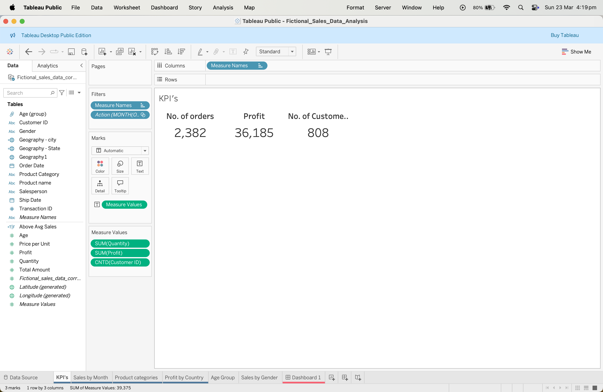
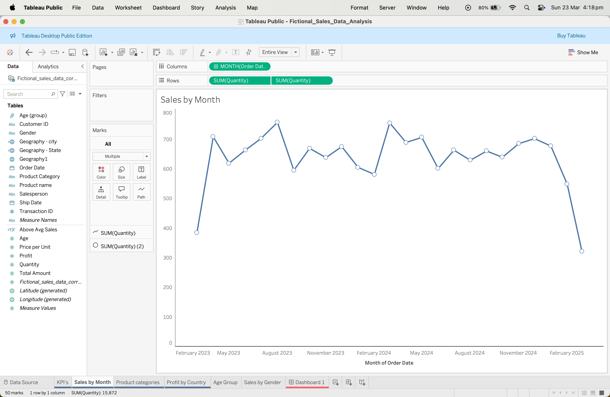
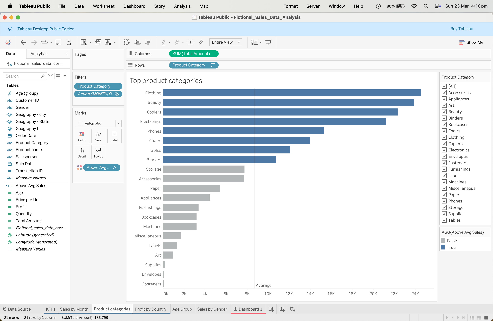
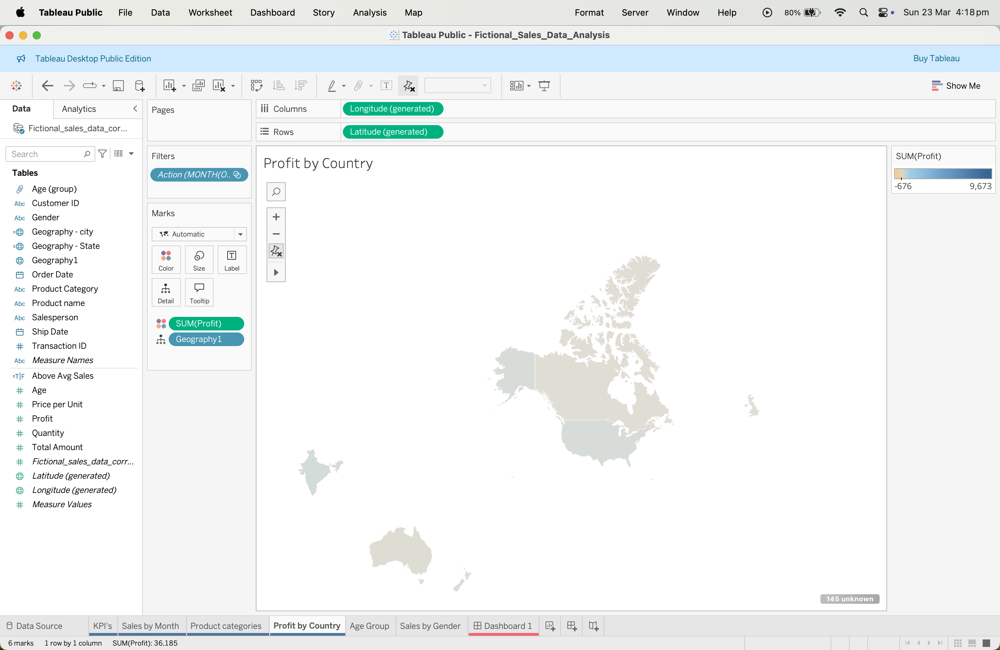
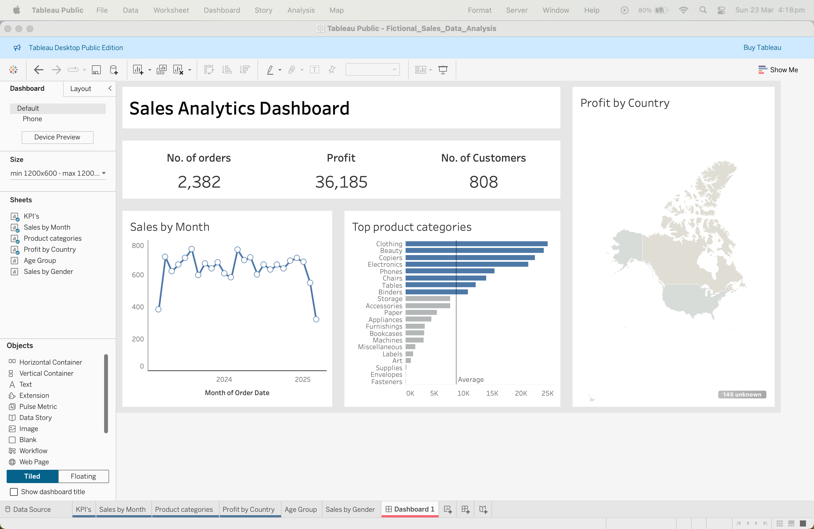

# 📊 Fictional Sales Dashboard – Tableau Project

An interactive dashboard project created in Tableau using a fictional retail sales dataset. This dashboard highlights customer behavior, product performance, and sales trends. The dataset was cleaned and explored using Python, and all assets are documented and version-controlled in this repository.

---

## 🗂 Project Structure

---

## 📈 Dashboard Features

- 🕒 Sales Trends Over Time  
- 👥 Customer Demographics (Age & Gender)  
- 🌍 Geographic Sales Insights  
- 📦 Top Product Categories  
- 💡 Interactive Filters & KPIs  

---

## 🔍 Screenshots

| KPI Overview | Sales by Month |
|--------------|----------------|
|  |  |

| Product Categories | Profit by Country |
|--------------------|-------------------|
|  |  |

### Full Dashboard Preview

---

## 💼 Tools Used

- **Python (Pandas, Matplotlib)** – Data cleaning & EDA  
- **Tableau** – Interactive dashboard creation  
- **Git + GitHub** – Version control & publishing  

---

## ▶️ How to Use

- Open the `.twbx` file from the `Dashboard/` folder using Tableau Desktop.  
- Use filters to explore trends by region, gender, product category, and time.  
- Review the dataset in the `data/` folder for reference.  

---

## 🔗 Live Repository

[https://github.com/XetawolfX2/sales-dashboard](https://github.com/XetawolfX2/fictional-sales-dashboard)

---

## ✅ Project Status

- Data cleaned ✅  
- Dashboard created ✅  
- GitHub structure organized ✅  
- Ready for portfolio ✅

